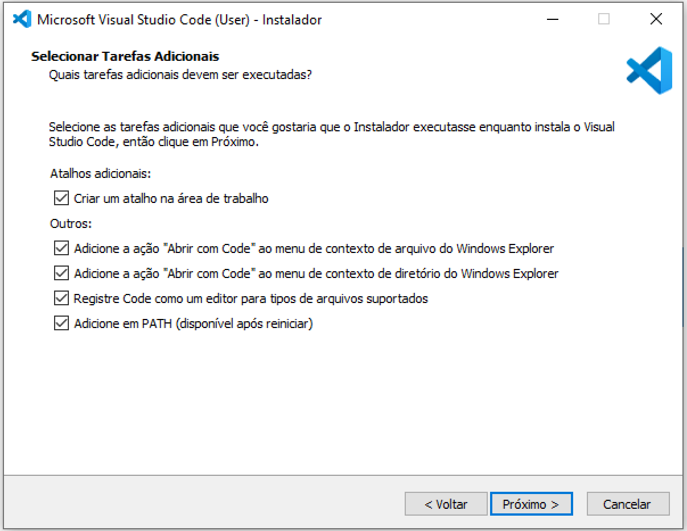
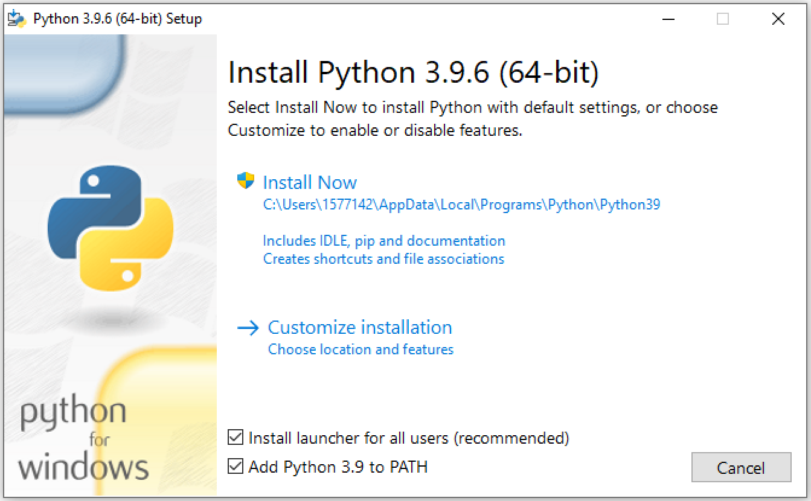

# asa-doc: Documentação para ASA

- Disciplina: Administração de Sistemas Abertos (ASA)
- Author: {{Nome}} {{Sobrenome}}

## Material necessário

- Conta no GitHub (Site para hospedagem de repositórios do Git)
- Git para Windows (Sistema que permite o uso do Git no Windows)
- Visual Studio Code (Editor de código extensível)
- Python (Linguagem de programação)

## Roteiro

1. Crie uma conta no [GitHub](https://github.com/) (Lembre-se de clicar no link que foi enviado por e-mail);
2. Instale o [Git para Windows](https://git-scm.com/download/win) com as opções padrões;
3. Instale o [Visual Studio Code](https://code.visualstudio.com/download), marcando todas as opções do diálogo **Selecionar Tarefas Adicionais**:
   
   

4. Instale o [Python](https://www.python.org/downloads/), marcando a opção **Add Python to PATH**:

    

## Configuração do Visual Studio Code

O Visual Studio Code (VS Code) é um editor de código extensível. Para documentação da disciplina, recomendo a instalação das seguintes extensões:

- [Portuguese (Brazil) Language Pack for Visual Studio Code](https://marketplace.visualstudio.com/items?itemName=MS-CEINTL.vscode-language-pack-pt-BR)
- [Vscode Google Translate](https://marketplace.visualstudio.com/items?itemName=funkyremi.vscode-google-translate)
- [vscode-icons](https://marketplace.visualstudio.com/items?itemName=vscode-icons-team.vscode-icons)
- [Python](https://marketplace.visualstudio.com/items?itemName=ms-python.python)
- [Markdown All in One](https://marketplace.visualstudio.com/items?itemName=yzhang.markdown-all-in-one)
- [Markdown Preview Enhanced](https://marketplace.visualstudio.com/items?itemName=shd101wyy.markdown-preview-enhanced)
- [docs-markdown](https://marketplace.visualstudio.com/items?itemName=docsmsft.docs-markdown)
- [MyST-Markdown](https://marketplace.visualstudio.com/items?itemName=ExecutableBookProject.myst-highlight)

## GitHub 

Faça uma bifurcação (*fork*) deste projeto. No canto superior direito da página, clique em Fork (Bifurcação).

A bifurcação (*fork*) tem várias utilidades em um projeto do GitHub. Ela será utilizada nesta documentação com a finalidade de [usar o projeto de outra pessoa como ponto de partida para sua própria ideia](https://docs.github.com/pt/github/getting-started-with-github/quickstart/fork-a-repo#use-someone-elses-project-as-a-starting-point-for-your-own-idea).

